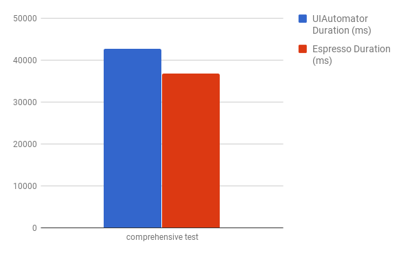

# Espresso vs. UIAutomator Results


## Data

Comparisons of the durations of identical UIAutomator and Espresso test on a Pixel_XL_API_O Emulator.
 




## Observations

#### Little to no performance improvement
Espresso appears to perform better on smaller benchmark tests, but for larger e2e tests there isn't much, if any, improvement. As you can see between these two screen capture videos [UIAutomator2 Video](assets/videos/uiautomator2-screen-recording.mov), [Espresso Video](assets/video/espresso-screen-recording.mov) the tests are indistinguishable from eachother. This only tests selecting, inputting text and clicking elements, though. Perhaps we'll see better results for actions like swiping and scrolling.

#### Less code
Because of Espresso's use of 'idling resources' (see https://google.github.io/android-testing-support-library/docs/espresso/idling-resource/) less Appium code is needed to do the same tests because it eliminates the task of waiting for the UI. For example, if I click on the 'App' menu item in the Android APIDemos app, it will navigate to another menu that has a 'Search' menu item. With UIAutomator2, we need to wait for the 'Search' item to exist before clicking on it. With Espresso, you can click on the 'Search' item right away because the thread blocks until the UI has finished updating before it applies the locator. So even though 'Search' doesn't exist at the time of performing the query, it will block until it's ready.

Here's an example of a Mocha/WD UIAutomator2 script and an Espresso script that do the same thing:

```javascript
// UIAutomator2
it("comprehensive test", async function () {

    // Open the Loader page and test that items show up
    await driver.init(desired);
    let appEl = await driver.elementByAccessibilityId('App');
    await appEl.click();
    await driver.waitForElementByAccessibilityId('Loader');
    let loaderEl = await driver.elementByAccessibilityId('Loader');
    await loaderEl.click();
    await driver.waitForElementByAccessibilityId('Custom');
    let cursorEl = await driver.elementByAccessibilityId('Custom');
    await cursorEl.click();
    await driver.waitForElementById('android:id/list');
    await driver.elementById('android:id/list');
    (await driver.elementsByXPath('//android.widget.ListView/android.widget.LinearLayout')).length.should.be.above(4);
    await driver.back();
    await driver.back();

    // Open the app/notification/statusbar page
    await driver.waitForElementByAccessibilityId('Notification');
    let notificationEl = await driver.elementByAccessibilityId('Notification');
    await notificationEl.click();
    await driver.waitForElementByAccessibilityId('IncomingMessage');
    let incomingMessageEl = await driver.elementByAccessibilityId('IncomingMessage');
    await incomingMessageEl.click();
    await driver.back();
    await driver.back();

    // Open the Custom Title activity and send keys
    await driver.waitForElementByAccessibilityId('Activity');
    let activityEl = await driver.elementByAccessibilityId('Activity');
    await activityEl.click();
    await driver.waitForElementByAccessibilityId('Custom Title');
    let customTitleEl = await driver.elementByAccessibilityId('Custom Title');
    await customTitleEl.click();
    await driver.waitForElementByAccessibilityId('Left is best');
    let leftTextEl = await driver.elementByXPath('//android.widget.EditText[@content-desc="Left is best"]');
    await leftTextEl.sendKeys(' hello world');
    let leftTextViewEl = await driver.elementByXPath('//android.widget.TextView[@content-desc="Left is best"]');
    await leftTextViewEl.text().should.eventually.equal('Left is best');
    await driver.back();
    await driver.back();
    await driver.back();

    // Open the alert dialogs
    await driver.waitForElementByAccessibilityId('Alert Dialogs');
    let alertDialogsEl = await driver.elementByAccessibilityId('Alert Dialogs');
    await alertDialogsEl.click();
    await driver.waitForElementByAccessibilityId('OK Cancel dialog with a message');
    let okCancelEl = await driver.elementByAccessibilityId('OK Cancel dialog with a message');
    await okCancelEl.click();
    await driver.waitForElementById('android:id/button2');
    let cancelButtonEl = await driver.elementById('android:id/button2');
    await cancelButtonEl.click();
    await driver.waitForElementByAccessibilityId('Text Entry dialog');
    let textEntryEl = await driver.elementByAccessibilityId('Text Entry dialog');
    await textEntryEl.click();
    await driver.waitForElementById('io.appium.android.apis:id/username_edit');
    let nameTextEl = await driver.elementById('io.appium.android.apis:id/username_edit');
    await nameTextEl.sendKeys('Hello World');
    let passwordEl = await driver.elementById('io.appium.android.apis:id/password_edit');
    await passwordEl.sendKeys('Foo Bar');
    let cancelEntryEl = await driver.elementById('android:id/button2');
    cancelEntryEl.click();
    await driver.back();
    await driver.back();

  });
``` 

```javascript
// Espresso
it("comprehensive test", async function () {

    // Open the Loader page and test that items show up
    await driver.init(desired);
    let appEl = await driver.elementByAccessibilityId('App');
    await appEl.click();
    let loaderEl = await driver.elementByAccessibilityId('Loader');
    await loaderEl.click();
    let cursorEl = await driver.elementByAccessibilityId('Custom');
    await cursorEl.click();
    await driver.elementById('android:id/list');
    (await driver.elementsByXPath('//android.widget.ListView/android.widget.LinearLayout')).length.should.be.above(4);
    await driver.back();
    await driver.back();

    // Open the app/notification/statusbar page
    let notificationEl = await driver.elementByAccessibilityId('Notification');
    await notificationEl.click();
    let incomingMessageEl = await driver.elementByAccessibilityId('IncomingMessage');
    await incomingMessageEl.click();
    await driver.back();
    await driver.back();

    // Open the Custom Title activity and send keys
    let activityEl = await driver.elementByAccessibilityId('Activity');
    await activityEl.click();
    let customTitleEl = await driver.elementByAccessibilityId('Custom Title');
    await customTitleEl.click();
    let leftTextEl = await driver.elementByXPath('//android.widget.EditText[@content-desc="Left is best"]');
    await leftTextEl.sendKeys(' hello world');
    let leftTextViewEl = await driver.elementByXPath('//android.widget.TextView[@content-desc="Left is best"]');
    await leftTextViewEl.text().should.eventually.equal('Left is best');
    await driver.back();
    await driver.back();
    await driver.back();

    // Open the alert dialogs
    let alertDialogsEl = await driver.elementByAccessibilityId('Alert Dialogs');
    await alertDialogsEl.click();
    let okCancelEl = await driver.elementByAccessibilityId('OK Cancel dialog with a message');
    await okCancelEl.click();
    let cancelButtonEl = await driver.elementById('android:id/button2');
    await cancelButtonEl.click();
    driver.waitForElementByAccessibilityId('Text Entry dialog');
    let textEntryEl = await driver.elementByAccessibilityId('Text Entry dialog');
    await textEntryEl.click();
    let nameTextEl = await driver.elementById('io.appium.android.apis:id/username_edit');
    await nameTextEl.sendKeys('Hello World');
    let passwordEl = await driver.elementById('io.appium.android.apis:id/password_edit');
    await passwordEl.sendKeys('Foo Bar');
    let cancelEntryEl = await driver.elementById('android:id/button2');
    cancelEntryEl.click();
    await driver.back();
    await driver.back();

  });
``` 

#### Espresso can only test one app
Espresso cannot test multiple apps, it can only test one. UIAutomator2 can test multiple apps.

## Conclusions
* The biggest benefit that Espresso provides is the use of idling resources. Not having to wait for the UI to render results in Appium scripts that are easier to write, easier to read and are less prone to error.
* The performance improvement is not substantial
* The downside to Espresso is not being able to test multiple apps.