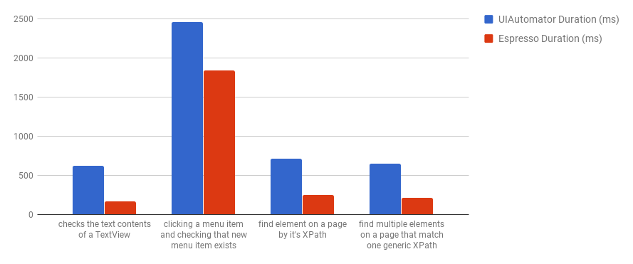
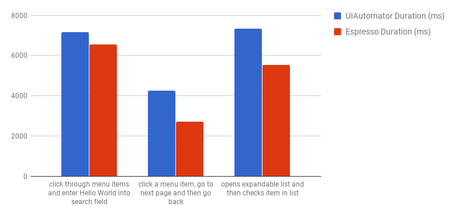
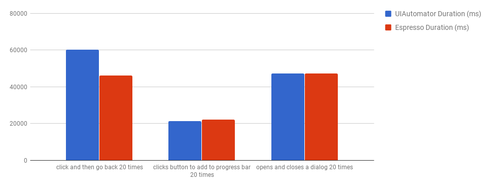

# Espresso vs. UIAutomator Results


## Data

Comparisons of the durations of identical UIAutomator and Espresso test
 




## Observations

#### Faster tests
Espresso performs as well as or better than UIAutomator2 tests across the board. Some of the tests saw significant performance improvements. Other tests had about the same results. In no cases did the Espresso test perform worse than the UIAutomator2 test (beyond an insignficant margin of difference). A reason for  performance benefit of the Espresso Driver over UIAutomator2 Driver is that, thanks to Espresso's underlying architecture and the use of what's called 'idling resources', it doesn't have to wait for the UI to finish rendering before performing operations on elements it. In the above benchmarks, when using UIAutomator2 we had to add waits for elements to exist before we could do something to them (click on them, send keys to them). For example, if I click on the 'App' menu item in the APIDemos app, it will take me to another menu that has a 'Search' menu item. With UIAutomator2, I need to wait for the 'Search' item to exist before I can click on it. With Espresso, after I click on the 'App' menu item, I can write a locator to get the 'Search' item and the Espresso test thread blocks until the UI has finished updating before it applies the locator. So even though 'Search' doesn't exist at the time of performing the query, it will block until it does. 

#### Less code
Because of Espresso's use of 'idling resources' (see https://google.github.io/android-testing-support-library/docs/espresso/idling-resource/) less Appium code is needed to do the same tests because it eliminates the task of waiting for the UI. Here's an example of a Mocha/WD UIAutomator2 script and an Espresso script that do the same thing:

```javascript
// UIAutomator2
it("opens and closes a dialog 20 times", async function () {
    await driver.init(desired);
    await (await driver.elementByAccessibilityId('App')).click();
    await driver.waitForElementByAccessibilityId('Alert Dialogs');
    await (await driver.elementByAccessibilityId('Alert Dialogs')).click();
    for (let i=0; i<20; i++) {
      await driver.waitForElementByAccessibilityId('OK Cancel dialog with a message');
      await (await driver.elementByAccessibilityId('OK Cancel dialog with a message')).click();
      await driver.waitForElementById('android:id/button2');
      await (await driver.elementById('android:id/button2')).click();
    }
  });
``` 

```javascript
// Espresso
it("opens and closes a dialog 20 times", async function () {
    await driver.init(desired);
    await (await driver.elementByAccessibilityId('App')).click();
    await (await driver.elementByAccessibilityId('Alert Dialogs')).click();
    for (let i=0; i<20; i++) {
      await (await driver.elementByAccessibilityId('OK Cancel dialog with a message')).click();
      await (await driver.elementById('android:id/button2')).click();
    }
});
``` 

The Espresso code does not have to wait for elements to exist before calling locators on them, because the Espresso Java thread does the job of waiting for the UI to finish rendering before it executes the next command.